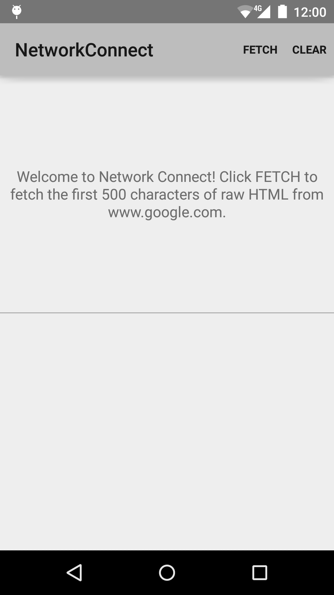

<<<<<<< HEAD

Android Home Automation
===================================

AsyncTask is used to perform the fetch on a background thread.

Introduction
------------

This sample application demonstrates how to connect to the network and fetch raw
HTML. It uses AsyncTask, a background task manager, to perform the network fetch
on a background thread. By using AsyncTask, the app can avoid hanging on the UI
thread, and instead update the UI when the response is ready. To establish the
network connection, the sample uses HttpURLConnection.

Pre-requisites
--------------

- Android SDK v22
- Android Build Tools v22.0.1
- Android Support Repository

Screenshots
-------------

 

Getting Started
---------------

Based on Adafruit CC3000 affordability

# hawifi
>>>>>>> 8304b097f7defe01438489c514bbaeefad8ab48e
